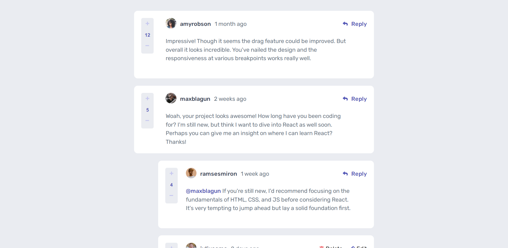

# Frontend Mentor - Interactive comments section solution

This is a solution to the [Interactive comments section challenge on Frontend Mentor](https://www.frontendmentor.io/challenges/interactive-comments-section-iG1RugEG9). Frontend Mentor challenges help you improve your coding skills by building realistic projects. 

## Table of contents

- [Overview](#overview)
  - [Screenshot](#screenshot)
  - [Links](#links)
- [My process](#my-process)
  - [Built with](#built-with)
- [Author](#author)

## Overview

### Screenshot

### Links

- Solution URL: [Solution URL](https://www.frontendmentor.io/solutions/intearactivecommentsection-bL33CII6z)
- Live Site URL: [Live site](https://elpidahope.github.io/interactive-comment-section/)

## My process

### Built with

- Semantic HTML5 markup
- CSS custom properties
- Flexbox
- CSS Grid
- Mobile-first workflow
- [React](https://reactjs.org/) - JS library
- Context API

## Author

- Website - [Jesufemi Oladapo]
- Frontend Mentor - [@ElpidaHope](https://www.frontendmentor.io/profile/ElpidaHope)
- Twitter - [@jesufemigan](https://www.twitter.com/jesufemigan)
